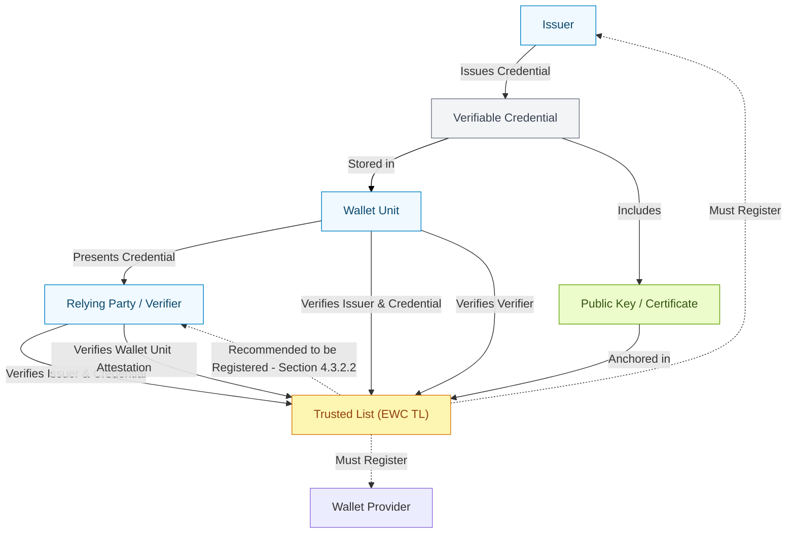

[](https://pkg.go.dev/github.com/sirosfoundation/g119612)
[](https://goreportcard.com/report/github.com/sirosfoundation/g119612)

[](https://opensource.org/licenses/BSD-2-Clause)

# golang ETSI trust status lists (aka ETSI 119 612 v2)

This is a golang library implementing ETSI trust status lists. The library is meant to be used primarily to create a certificate pool for validating X509 certificates. The library was created to cater to the evolving EUDI wallet ecosystem but other uses are possible. Feel free to drop a PR or an issue if you see something you would like to change.

The library should be fully reentrant. There is no caching of URLs or other artefacts so make sure you fetch your TSLs from a CDN or similar and ensure availability.

## Features

- **Full ETSI TS 119 612 support**: Parse, validate, and process Trust Status Lists
- **XML Digital Signature Validation**: Built-in validation of XML signatures on TSLs
- **Certificate Pool Creation**: Build x509.CertPool from TSLs for certificate verification
- **Pipeline Processing**: YAML-configurable pipeline for batch TSL processing
- **XSLT Transformation**: Transform TSLs to HTML with embedded stylesheets
- **Structured Logging**: Configurable logging with multiple output formats

## Installation

```bash
go get github.com/sirosfoundation/g119612
```

## Basic Usage

The example below assumes you have imported the crypto/x509 and etsi119612 module (the latter from this package).

First step: fetch and create a TSL object
```go
    import (
        "github.com/sirosfoundation/g119612/pkg/etsi119612"
    )

    tsl, err := etsi119612.FetchTSL("https://example.com/some-tsl.xml")

    if err != nil {
	// do some error handling
    }
```

Next step: build a cert-pool from the trust status list with default validation policy
```go
    pool := tsl.ToCertPool(etsi119612.PolicyAll)
```

Finally: validate some cert
```go
    _, err = cert.Verify(x509.VerifyOptions{Roots: pool})
    if err != nil {
        //cert is INVALID
    }
```

## Command-Line Tool: tsl-tool

The `tsl-tool` command provides batch processing of TSLs using a YAML-defined pipeline:

```bash
# Build the tool
make build

# Run with a pipeline configuration
./tsl-tool --log-level debug pipeline.yaml
```

### Pipeline Configuration

Create a YAML file defining your processing steps:

```yaml
# pipeline.yaml
- set-fetch-options:
    - user-agent:TSL-Tool/1.0
    - timeout:60s
- load:
    - https://ec.europa.eu/tools/lotl/eu-lotl.xml
- select:
    - reference-depth:2
- transform:
    - embedded:tsl-to-html.xslt
    - /var/www/html/tsl
    - html
- generate_index:
    - /var/www/html/tsl
    - "EU Trust Lists"
```

### Available Pipeline Steps

| Step | Description |
|------|-------------|
| `load` | Load TSL from URL or file path |
| `select` | Build certificate pool from loaded TSLs |
| `transform` | Apply XSLT transformation to generate HTML |
| `publish` | Write TSLs to output files |
| `generate` | Generate new TSL from metadata |
| `generate_index` | Create HTML index page for TSL collection |
| `log` | Output messages to the log |
| `set-fetch-options` | Configure HTTP client options |
| `echo` | No-op placeholder step |

## Packages

| Package | Description |
|---------|-------------|
| `etsi119612` | Core TSL parsing and certificate pool creation |
| `dsig` | XML Digital Signature validation |
| `pipeline` | YAML-configurable pipeline processing |
| `validation` | TSL and certificate validation utilities |
| `xslt` | XSLT transformation with embedded stylesheets |
| `logging` | Structured logging framework |
| `utils` | Common utility functions |

## Trust List in the EUDI Infrastructure - General Overview:

Document for the reference:
https://github.com/EWC-consortium/eudi-wallet-rfcs/blob/main/ewc-rfc012-trust-mechanism.md#433-relying-parties



## Contributing

Contributions are welcome! Please feel free to submit issues or pull requests.

### Development Requirements

- Go 1.25 or later
- Make

### Running Tests

```bash
make test
```

### Code Generation

If you want to "make gen" to re-generate the golang from the etsi XSD then you must install https://github.com/xuri/xgen first. Note that the generated code is post-processed (sed) to fix a couple of "features" in xgen that I am too lazy to pursue as bugs in xgen at this point. This stuff may change so run "make gen" at your own peril. The generated code that is known to work is commited into the repo for this reason - ymmw.

## License

BSD 2-Clause License - see [LICENSE.txt](LICENSE.txt)

