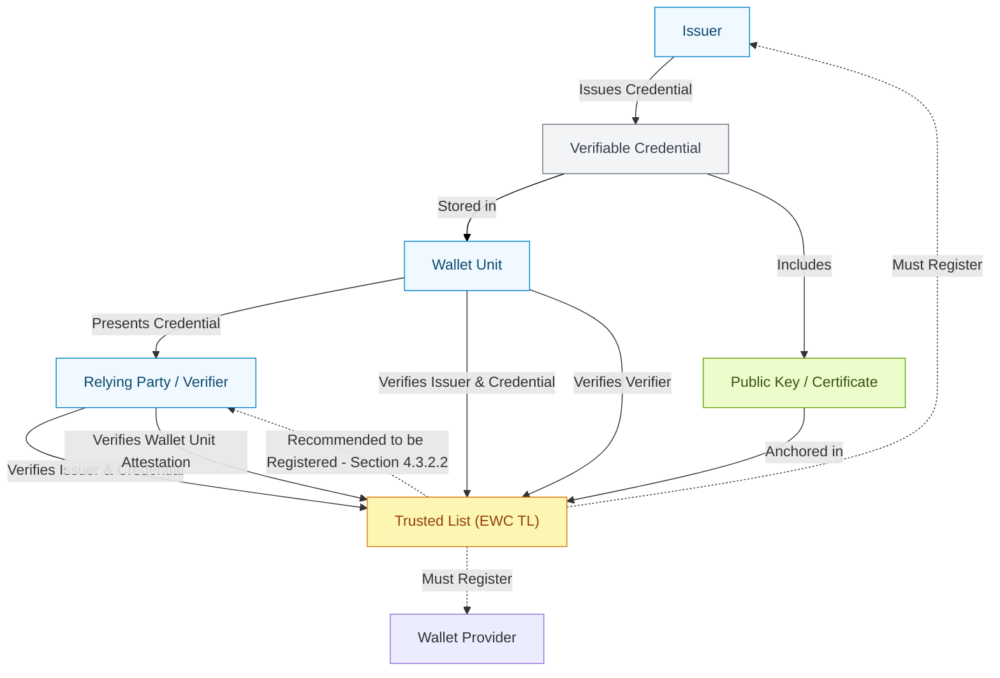

[](https://pkg.go.dev/github.com/sirosfoundation/g119612)
[](https://goreportcard.com/report/github.com/sirosfoundation/g119612)

[](https://opensource.org/licenses/BSD-2-Clause)

# golang ETSI Trust Lists (TS 119 612 + TS 119 602)

A Go library for working with ETSI trust lists — both the traditional XML-based **Trust Status Lists** (ETSI TS 119 612) and the modern JSON-based **Lists of Trusted Entities** (ETSI TS 119 602, LoTE). The library was created to cater to the evolving EUDI wallet ecosystem but other uses are possible. Feel free to drop a PR or an issue if you see something you would like to change.

The library is fully reentrant. There is no caching of URLs or other artefacts so make sure you fetch your TSLs/LoTEs from a CDN or similar and ensure availability.

## Features

### ETSI TS 119 612 (Trust Status Lists — XML)

- **Full TSL parsing**: Parse, validate, and process Trust Status Lists
- **XML Digital Signature Validation**: Built-in validation of XML signatures on TSLs
- **Certificate Pool Creation**: Build `x509.CertPool` from TSLs for certificate verification
- **Extensible Crypto Support**: Brainpool curves and other non-standard algorithms via `go-cryptoutil`
- **XSLT Transformation**: Transform TSLs to HTML with embedded stylesheets

### ETSI TS 119 602 (Lists of Trusted Entities — JSON)

- **LoTE parsing and generation**: Create, load, validate, and publish LoTE JSON documents
- **TSL → LoTE conversion**: Convert existing ETSI TS 119 612 TSLs to LoTE format
- **JWS signing and verification**: Sign LoTEs with JWS (file-based keys or PKCS#11/HSM)
- **Content validation**: Structural validation of LoTE documents before publishing
- **Multiple digital identity types**: X.509 certificates, JWK keys, and DIDs
- **Merge and sequence management**: Merge multiple LoTEs and auto-increment sequence numbers

### Common

- **Pipeline Processing**: YAML-configurable pipeline for batch TSL and LoTE processing
- **Structured Logging**: Configurable logging with multiple output formats

## Installation

```bash
go get github.com/sirosfoundation/g119612
```

## Basic Usage

### Working with TSLs (ETSI TS 119 612)

The example below assumes you have imported the crypto/x509 and etsi119612 module (the latter from this package).

First step: fetch and create a TSL object
```go
    import (
        "github.com/sirosfoundation/g119612/pkg/etsi119612"
    )

    tsl, err := etsi119612.FetchTSL("https://example.com/some-tsl.xml")

    if err != nil {
	// do some error handling
    }
```

Next step: build a cert-pool from the trust status list with default validation policy
```go
    pool := tsl.ToCertPool(etsi119612.PolicyAll)
```

Finally: validate some cert
```go
    _, err = cert.Verify(x509.VerifyOptions{Roots: pool})
    if err != nil {
        //cert is INVALID
    }
```

### Working with LoTEs (ETSI TS 119 602)

Load a LoTE from a URL or file:
```go
    lote, err := etsi119602.FetchLoTE("https://example.com/lote.json", nil)
    if err != nil {
        // handle error
    }
    fmt.Printf("Territory: %s, Entities: %d\n",
        lote.SchemeInformation.Territory,
        len(lote.TrustedEntities))
```

Validate a LoTE before publishing:
```go
    if err := lote.Validate(); err != nil {
        // LoTE has structural issues
    }
```

Convert an existing TSL to LoTE format:
```go
    tsl, _ := etsi119612.FetchTSL("https://example.com/tsl.xml")
    lote := etsi119602.FromTSL(tsl)
```

## Command-Line Tool: tsl-tool

The `tsl-tool` command provides batch processing of TSLs using a YAML-defined pipeline:

```bash
# Build the tool
make build

# Run with a pipeline configuration
./tsl-tool --log-level debug pipeline.yaml
```

### Pipeline Configuration

Create a YAML file defining your processing steps:

```yaml
# pipeline.yaml
- set-fetch-options:
    - user-agent:TSL-Tool/1.0
    - timeout:60s
- load:
    - https://ec.europa.eu/tools/lotl/eu-lotl.xml
- select:
    - reference-depth:2
- transform:
    - embedded:tsl-to-html.xslt
    - /var/www/html/tsl
    - html
- generate_index:
    - /var/www/html/tsl
    - "EU Trust Lists"
    # generates both index.html and report.html
    # add 'no-report' to skip report generation
```

#### Brainpool / Extended Crypto Support

The `tsl-tool` CLI automatically registers brainpool curve support via
`go-cryptoutil`, enabling parsing and signature verification for EU TSLs
that use brainpool P256r1/P384r1/P512r1 certificates (e.g. Germany's gematik).

When using the library programmatically, set `CryptoExt` on the pipeline context:

```go
import (
    "github.com/sirosfoundation/go-cryptoutil"
    "github.com/sirosfoundation/go-cryptoutil/brainpool"
    "github.com/sirosfoundation/g119612/pkg/pipeline"
)

ext := cryptoutil.New()
brainpool.Register(ext)

ctx := &pipeline.Context{}
ctx.CryptoExt = ext
// CryptoExt automatically propagates to TSL fetch options and certificate pool building
```

### Available Pipeline Steps

#### TSL Steps (ETSI TS 119 612)

| Step | Description |
|------|-------------|
| `load` | Load TSL from URL or file path |
| `select` | Build certificate pool from loaded TSLs |
| `transform` | Apply XSLT transformation to generate HTML |
| `publish` | Write TSLs to output files |
| `generate` | Generate new TSL from metadata |
| `generate_index` | Create HTML index page + pipeline report |
| `report` | Generate standalone pipeline report |
| `log` | Output messages to the log |
| `set-fetch-options` | Configure HTTP client options |
| `echo` | No-op placeholder step |

### TSL Generation Directory Structure

The `generate` step creates a TSL from a directory of YAML metadata and certificate files:

```
tsl-source/
├── scheme.yaml              # TSL scheme metadata
└── providers/               # One subdirectory per trust service provider
    └── my-provider/
        ├── provider.yaml    # Provider metadata
        ├── cert1.pem        # X.509 certificate (DER-encoded bytes; despite the example extension, not PEM text)
        └── cert1.yaml       # Service metadata for cert1.pem
```

**scheme.yaml:**
```yaml
operatorNames:
  - language: en
    value: "Trust List Operator"
type: "http://uri.etsi.org/TrstSvc/TrustedList/TSLType/EUgeneric"
sequenceNumber: 1    # Optional, defaults to 1
id: "MY-TSL-001"     # Optional, defaults to "TSL-NNN"
```

**provider.yaml:**
```yaml
names:
  - language: en
    value: "Example Trust Service Provider"
address:                      # Optional
  postal:
    streetAddress: "Example Street 123"
    locality: "Example City"
    postalCode: "12345"
    countryName: "SE"
  electronic:
    - "https://example.com"
    - "mailto:contact@example.com"
tradeName:                    # Optional
  - language: en
    value: "Example Corp"
informationURI:               # Optional
  - language: en
    value: "https://example.com/info"
```

**cert.yaml** (must match a `.pem` file by base name, e.g. `cert1.yaml` ↔ `cert1.pem`):
```yaml
serviceNames:
  - language: en
    value: "Example Signing Service"
serviceType: "http://uri.etsi.org/TrstSvc/Svctype/CA/QC"
status: "http://uri.etsi.org/TrstSvc/TrustedList/Svcstatus/granted"
serviceDigitalId:             # Optional additional digital IDs
  digitalIds:
    - "base64-encoded-cert..."
```

#### LoTE Steps (ETSI TS 119 602)

| Step | Description |
|------|-------------|
| `load-lote` | Load LoTE from URL or file path, optionally verify JWS signature |
| `generate-lote` | Generate LoTE from a directory structure (YAML metadata + cert/JWK/DID files) |
| `publish-lote` | Write LoTE JSON files, optionally sign with JWS (file key or PKCS#11/HSM) |
| `convert-to-lote` | Convert all TSLs on the context stack to LoTE format |
| `merge-lote` | Merge multiple LoTEs into a single LoTE |
| `increment-lote-sequence` | Increment the sequence number on all LoTEs in context |

### LoTE Pipeline Examples

Convert an EU TSL to LoTE and publish as signed JSON:
```yaml
- set-fetch-options:
    - user-agent:TSL-Tool/1.0
    - timeout:60s
- load:
    - https://ec.europa.eu/tools/lotl/eu-lotl.xml
- select:
    - reference-depth:2
- convert-to-lote:
- merge-lote:
- increment-lote-sequence:
- publish-lote:
    - /var/www/html/lote
    - /path/to/signing-cert.pem
    - /path/to/signing-key.pem
```

Generate a LoTE from a directory structure:
```yaml
- generate-lote:
    - /path/to/lote-source
- publish-lote:
    - /var/www/html/lote
```

### LoTE Source Directory Structure

The `generate-lote` step expects a directory with YAML metadata and identity files:

```
lote-source/
├── scheme.yaml
└── entities/
    ├── my-issuer/
    │   ├── entity.yaml
    │   ├── signing-cert.pem    # X.509 certificate (PEM or DER)
    │   └── auth-key.jwk        # JWK key (JSON)
    └── my-verifier/
        ├── entity.yaml
        └── identity.did         # DID identifier
```

**scheme.yaml:**
```yaml
operatorNames:
  - language: en
    value: "My Trust Scheme Operator"
schemeName:
  - language: en
    value: "My Trust Scheme"
schemeType: "http://uri.etsi.org/TrstSvc/TrustedList/TSLType/EUgeneric"
territory: "SE"
sequenceNumber: 1
```

**entity.yaml:**
```yaml
entityId: "https://issuer.example.com"
entityType: "http://example.com/entity-type"  # Optional entity type URI
names:
  - language: en
    value: "Example Credential Issuer"
status: "http://uri.etsi.org/TrstSvc/TrustedList/Svcstatus/granted"  # Defaults to "granted" if omitted
services:
  - serviceType: "http://uri.etsi.org/TrstSvc/Svctype/CA/QC"
    serviceNames:
      - language: en
        value: "Qualified Certificate Service"
    status: "http://uri.etsi.org/TrstSvc/TrustedList/Svcstatus/granted"
```

## Packages

| Package | Description |
|---------|-------------|
| `etsi119612` | Core TSL types, parsing, and certificate pool creation (ETSI TS 119 612) |
| `etsi119602` | LoTE types, parsing, validation, fetching, and TSL→LoTE conversion (ETSI TS 119 602) |
| `dsig` | XML Digital Signature validation (including PKCS#11/HSM support) |
| `jws` | JWS signing and verification for LoTE documents (file keys and PKCS#11/HSM) |
| `pipeline` | YAML-configurable pipeline processing for both TSL and LoTE workflows |
| `validation` | URL, file path, and output directory validation utilities |
| `xslt` | XSLT transformation with embedded stylesheets |
| `logging` | Structured logging framework |
| `utils` | Common utility functions |

## Trust List in the EUDI Infrastructure - General Overview:

Document for the reference:
https://github.com/EWC-consortium/eudi-wallet-rfcs/blob/main/ewc-rfc012-trust-mechanism.md#433-relying-parties


```mermaid
flowchart TD
    Issuer["Issuer"] -- Issues Credential --> Credential["Verifiable Credential"]
    Credential -- Stored in --> Wallet["Wallet Unit"]
    Wallet -- Presents Credential --> Verifier["Relying Party / Verifier"]
    Credential -- Includes --> Key["Public Key / Certificate"]
    Key -- Anchored in --> TL["Trusted List (EWC TL)"]
    Verifier -- Verifies Issuer & Credential --> TL
    Wallet -- Verifies Issuer & Credential --> TL
    Wallet -- Verifies Verifier --> TL
    Verifier -- Verifies Wallet Unit Attestation --> TL
    TL -. Must Register .-> Issuer & WalletProvider["Wallet Provider"]
    TL -. "Recommended to be Registered - Section 4.3.2.2" .-> Verifier

     Issuer:::actor
     Credential:::doc
     Wallet:::actor
     Verifier:::actor
     Key:::key
     TL:::trustlist
    classDef trustlist fill:#fdf6b2,stroke:#d97706,color:#92400e
    classDef actor fill:#f0f9ff,stroke:#0284c7,color:#0c4a6e
    classDef doc fill:#f3f4f6,stroke:#6b7280,color:#374151
    classDef key fill:#ecfccb,stroke:#65a30d,color:#365314
    linkStyle 1 stroke:#000000
```

## Contributing

Contributions are welcome! Please feel free to submit issues or pull requests.

### Development Requirements

- Go 1.25 or later
- Make

### Running Tests

```bash
make test
```

### Code Generation

If you want to "make gen" to re-generate the golang from the etsi XSD then you must install https://github.com/xuri/xgen first. Note that the generated code is post-processed (sed) to fix a couple of "features" in xgen that I am too lazy to pursue as bugs in xgen at this point. This stuff may change so run "make gen" at your own peril. The generated code that is known to work is commited into the repo for this reason - ymmw.

## License

BSD 2-Clause License - see [LICENSE.txt](LICENSE.txt)

